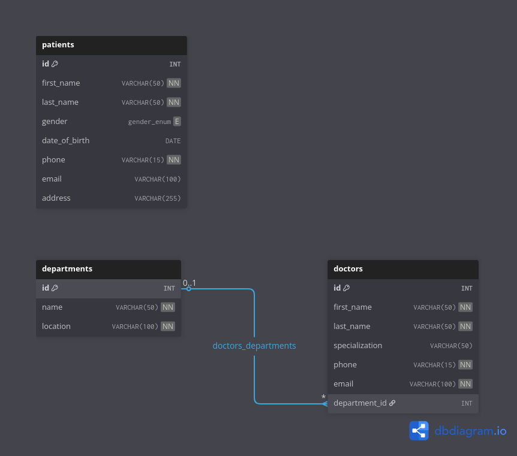
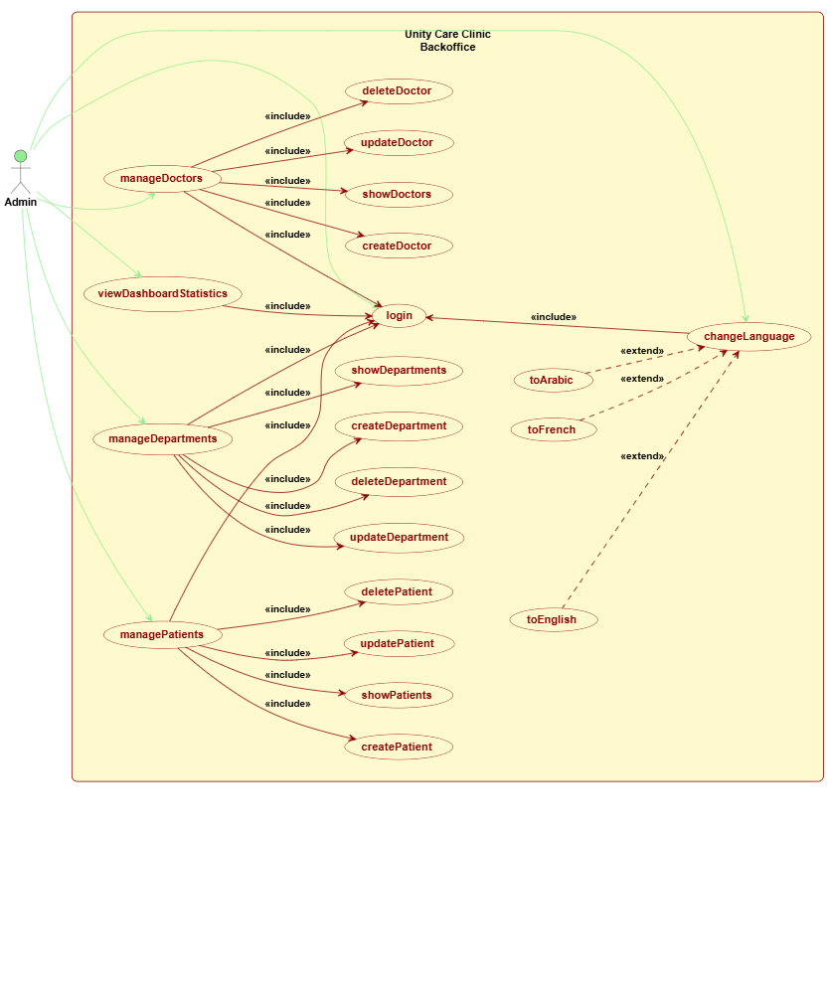

# 🏥 Unity Care Clinic V2 – Console CRUD App

A PHP console-based clinic management tool that manages patients, doctors, and departments with a menu-driven interface, using classes, inheritance, and composition to reflect the designed class and ER diagrams.

## 📑 Table of Contents

-   [Project Overview](#project-overview)
-   [Tech Stack](#tech-stack)
-   [Project Structure](#project-structure)
-   [Environment Variables](#environment-variables)
-   [Installation & Setup](#installation-setup)
-   [Domain Model](#domain-model)
-   [Diagrams](#diagrams)
-   [Features Breakdown](#features-breakdown)
-   [License](#license)
-   [Contributing](#contributing)

## <h2 id="project-overview">🎯 Project Overview</h2>

This mini-project is a **console-only** CRUD application for managing clinic data, focusing on OOP design (abstract parents, composition, and concrete models) instead of any web frontend. The structure is aligned with the class diagram: shared behavior lives in abstract parent classes, while specific logic resides in `Patient`, `Doctor`, and `Department` classes.

The application uses the **Singleton pattern** for database connections and implements a clean separation between domain models and data access through abstract base classes.

## <h2 id="tech-stack">🛠️ Tech Stack</h2>

-   PHP 8.x (CLI mode)
-   MySQL (persistence)
-   PDO for database abstraction
-   `vlucas/phpdotenv` for loading environment variables from `.env` via Composer

## <h2 id="project-structure">📁 Project Structure</h2>

```
Unity-Care-Clinic-V2
├── README.md
├── console.php                        # Main CLI entry point (php console.php)
├── .env.example                       # Example env file template
├── composer.json                      # Composer dependencies & autoload
├── composer.lock                      # Generated by Composer
└── assets
    ├── media
    │   ├── class-diagram-overkill.wsd
    │   ├── class-diagram.png
    │   ├── class-diagram.wsd
    │   ├── erd.dbdiagram
    │   ├── erd.dbml
    │   ├── erd.png
    │   ├── usecase-diagram.png
    │   └── usecase-diagram.wsd
    ├── php
    │   ├── class
    │   │   ├── composition
    │   │   │   └── Validator.php      # Validation composition helper
    │   │   ├── config
    │   │   │   └── DataBase.php       # Singleton DB connection manager
    │   │   ├── parent
    │   │   │   └── abstract
    │   │   │       ├── BaseModal.php  # Base CRUD operations & reflection
    │   │   │       └── Person.php     # Abstract parent for Patient & Doctor
    │   │   ├── Department.php         # Department domain model
    │   │   ├── Doctor.php             # Doctor domain model
    │   │   └── Patient.php            # Patient domain model
    │   └── test.php                   # Testing scripts
    └── sql
        ├── crud-templates.sql         # SQL query templates
        ├── ddl.sql                    # Database schema
        └── dml.sql                    # Seed data
```

This layout keeps OOP classes inside `assets/php/class`, database configuration in `assets/php/class/config`, and diagrams/SQL under `assets/media` and `assets/sql` respectively.

## <h2 id="environment-variables">🔐 Environment Variables</h2>

Environment configuration is handled via `.env`, loaded by `vlucas/phpdotenv` in the `DataBase` class constructor. `.env` is ignored by Git, while `.env.example` documents all required variables for collaborators.

### Install Composer and phpdotenv

If Composer is not installed globally:

```bash
cd ~
curl -sS https://getcomposer.org/installer -o /tmp/composer-setup.php
sudo php /tmp/composer-setup.php --install-dir=/usr/local/bin --filename=composer
```

Inside your project:

```bash
cd Unity-Care-Clinic-V2
composer require vlucas/phpdotenv
```

### Environment Files

**.env.example** (template you commit):

```env
DB_HOST=127.0.0.1
DB_PORT=3306
DB_NAME=uccv2
DB_USER=root
DB_PASS=secret
APP_ENV=local
APP_DEBUG=true
```

**.env** (your local copy, not committed):

```env
DB_HOST=127.0.0.1
DB_PORT=3306
DB_NAME=uccv2
DB_USER=your_user
DB_PASS=your_password
APP_ENV=local
APP_DEBUG=true
```

The `.env` file is automatically loaded by the `DataBase` singleton class, which initializes the PDO connection with proper error handling and fetch modes.

## <h2 id="installation-setup">🚀 Installation & Setup</h2>

1. **Clone the repository**

    ```bash
    git clone <repository-url>
    cd Unity-Care-Clinic-V2
    ```

2. **Install PHP dependencies**

    ```bash
    composer install
    ```

3. **Configure environment**

    - Copy `.env.example` to `.env`
    - Update DB credentials and other values to match your local setup

4. **Database setup**

    - Create a database (e.g. `uccv2`)
    - Import schema and seed data:
        ```bash
        mysql -u <username> -p uccv2 < assets/sql/ddl.sql
        mysql -u <username> -p uccv2 < assets/sql/dml.sql
        ```

5. **Run the console application**
    ```bash
    php console.php
    ```
    This will start the menu-driven CLI to manage patients, doctors, and departments.

## <h2 id="domain-model">📦 Domain Model</h2>

The domain layer closely follows the class diagram using abstract parents and composition to keep behavior **reusable** and cohesive.

### Core Architecture

-   **`config/DataBase.php`**

    -   Implements Singleton pattern for database connection management
    -   Loads environment variables via `phpdotenv`
    -   Provides PDO instance with proper configuration
    -   Prevents multiple database connections

-   **`parent/abstract/BaseModal.php`**

    -   Foundation for all domain models
    -   Implements generic CRUD operations (Create, Read, Update, Delete)
    -   Fetches table headers dynamically from `INFORMATION_SCHEMA`
    -   Provides reflection-based `toArray()` and `fromArray()` methods
    -   Includes abstract `getStatistics()` for model-specific analytics
    -   Uses prepared statements for SQL injection prevention

-   **`parent/abstract/Person.php`**
    -   Extends `BaseModal`
    -   Abstract parent for `Patient` and `Doctor` models
    -   Encapsulates shared attributes: first name, last name, phone, email
    -   Provides common getters and setters for person-related data

### Domain Models

-   **`Patient.php`**

    -   Extends `Person`
    -   Additional attributes: gender (enum), date of birth, address
    -   Implements patient-specific statistics (count by gender, average age)
    -   Uses PHP 8.1+ `enum` for gender type safety

-   **`Doctor.php`**

    -   Extends `Person`
    -   Additional attributes: specialization, department_id (nullable foreign key)
    -   Validates foreign key constraints against existing departments
    -   Provides statistics on doctors per department and specialization

-   **`Department.php`**
    -   Extends `BaseModal` directly
    -   Attributes: name, location
    -   Provides department statistics and doctor counts
    -   Static method `getIds()` for foreign key validation

### Composition

-   **`composition/Validator.php`**
    -   Composition helper for data validation
    -   Used by models to validate input before persistence

## <h2 id="diagrams">🧩 Diagrams</h2>

Diagram sources are stored under `assets/media` to document the design process and keep UML artifacts alongside the code.

### Class Diagram


-   Image: `assets/media/class-diagram.png`
-   Source: `assets/media/class-diagram.wsd`
-   Overkill version: `assets/media/class-diagram-overkill.wsd`

Shows the inheritance hierarchy and relationships between `BaseModal`, `Person`, `Patient`, `Doctor`, and `Department`.

### Entity-Relationship Diagram (ERD)



-   Image: `assets/media/erd.png`
-   Sources: `assets/media/erd.dbml`, `assets/media/erd.dbdiagram`

Visualizes the database schema and foreign key relationships between tables.

### Use Case Diagram



-   Image: `assets/media/usecase-diagram.png`
-   Source: `assets/media/usecase-diagram.wsd`

Documents the system's functional requirements and user interactions.

These files can be opened in compatible tools (PlantUML for `.wsd`, dbdiagram.io for `.dbml`) to regenerate or modify the diagrams as the project evolves.

## <h2 id="features-breakdown">🎨 Features Breakdown</h2>

### CRUD Operations

-   **Create**: Add new patients, doctors, and departments
-   **Read**: View all records or fetch by ID
-   **Update**: Modify existing records with validation
-   **Delete**: Remove records with cascading considerations

### Object-Oriented Features

-   **Abstract Classes**: `BaseModal` and `Person` provide reusable base functionality
-   **Inheritance**: `Patient` and `Doctor` inherit from `Person`
-   **Encapsulation**: Private properties with public getters/setters
-   **Reflection**: Dynamic property mapping between objects and arrays
-   **Type Safety**: PHP 8.1+ enums for gender, typed properties throughout

### Database Features

-   **Singleton Pattern**: Single database connection instance
-   **Prepared Statements**: Protection against SQL injection
-   **Dynamic Schema Reading**: Headers fetched from `INFORMATION_SCHEMA`
-   **Foreign Key Validation**: Departments validated before doctor assignment
-   **Statistics Methods**: Each model provides relevant analytics

### Console Interface

-   Menu-driven CLI for easy navigation
-   Separate modules for patients, doctors, and departments
-   Input validation and error handling
-   Display formatting with table headers

## <h2 id="license">📝 License</h2>

This project is intended for educational and portfolio use; you may read and adapt the code for learning purposes.

## <h2 id="contributing">🤝 Contributing</h2>

Suggestions to improve class design, validation logic, statistics methods, or console UX are welcome. Please open an issue or submit a clearly described pull request with:

-   Clear description of the change
-   Reasoning behind the improvement
-   Any relevant test cases or examples

---

**Note**: Make sure your `.env` file is properly configured with valid database credentials before running the application. The `DataBase` singleton will fail fast with a clear error message if connection cannot be established.
